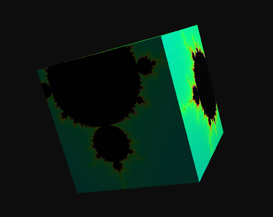

# lisp-examples

A collection of Common Lisp examples and experiments.

**Requirements for all OpenGL examples:** SBCL, Quicklisp with `cl-opengl`, `cl-glfw3`, `3d-vectors`, `3d-matrices`

Start SLIME first, then load Quicklisp:
```
M-x slime
```
```lisp
(load "~/quicklisp/setup.lisp")
```

---

## Examples

### opengl-cube-blue-waves.lsp
Rotating 3D cube with a procedural animated water shader.

```lisp
(load "/home/sugras/pproj/lisp/lisp-examples/opengl-cube-blue-waves.lsp")
(cube:start)
```

```lisp
(setf cube:*angle* 0.0)    ; reset rotation
(setf cube:*time* 0.0)     ; reset wave animation
(setf cube:*running* nil)  ; stop
(cube:start)               ; restart
```

---

### opengl-lighting.lsp
Rotating cube with Phong lighting (ambient + diffuse + specular). Introduces normals and a light source.

```lisp
(load "/home/sugras/pproj/lisp/lisp-examples/opengl-lighting.lsp")
(lighting:start)
```

```lisp
(setf lighting:*angle* 0.0)          ; reset rotation
(setf lighting:*running* nil)        ; stop
(lighting:start)                     ; restart

; move the light around:
(setf lighting:*light-pos* '(2.0 2.0 2.0))   ; default
(setf lighting:*light-pos* '(-2.0 2.0 2.0))  ; light from left
(setf lighting:*light-pos* '(0.0 5.0 0.0))   ; light from above
```

---

### opengl-colored-lighting.lsp
Rotating cube combining per-face colors with Phong lighting. Each face has its own color (red, green, blue, yellow, cyan, magenta) lit by ambient + diffuse + specular.

```lisp
(load "/home/sugras/pproj/lisp/lisp-examples/opengl-colored-lighting.lsp")
(cube-mandelbrot:start)
```

```lisp
(setf cube-mandelbrot:*light-pos* '(2.0 2.0 2.0))   ; default
(setf cube-mandelbrot:*light-pos* '(-2.0 3.0 1.0))  ; light from left
(setf cube-mandelbrot:*running* nil)                 ; stop
```

---

### opengl-cube-mandelbrot.lsp
Rotating cube with the Mandelbrot set mapped onto each face + Phong lighting. All faces share the same view. Pan, zoom and colors controllable via REPL.

```lisp
(load "/home/sugras/pproj/lisp/lisp-examples/opengl-cube-mandelbrot.lsp")
(cube-mandelbrot:start)
```

```lisp
(setf cube-mandelbrot:*zoom* 3.0)              ; zoom in
(setf cube-mandelbrot:*center-x* -0.7435)     ; pan to seahorse valley
(setf cube-mandelbrot:*center-y*  0.1314)
(setf cube-mandelbrot:*max-iter* 200)          ; more detail
(setf cube-mandelbrot:*palette-speed* 0.02)   ; faster color flow
(setf cube-mandelbrot:*light-pos* '(-2.0 3.0 2.0))
(setf cube-mandelbrot:*running* nil)           ; stop
```

---

### opengl-cube-mandelbrot-animated.lsp
Same as above but each of the 6 faces independently zooms into a different boundary point of the Mandelbrot set. Faces automatically wander along the boundary, zoom in and out, and cycle through interesting locations — all running simultaneously.



```lisp
(load "/home/sugras/pproj/lisp/lisp-examples/opengl-cube-mandelbrot-animated.lsp")
(cube-mandelbrot:start)
```

```lisp
(setf cube-mandelbrot:*palette-speed* 0.02)   ; faster color flow
(setf cube-mandelbrot:*max-iter* 200)          ; more detail
(setf cube-mandelbrot:*light-pos* '(-2.0 3.0 2.0))
(setf cube-mandelbrot:*running* nil)           ; stop
```

---

### opengl-cube-sphere-morph.lsp

<video src="morphing.webm" autoplay loop muted width="640"></video>

A subdivided cube (8×8 quads per face = 768 triangles total) that continuously morphs between a cube and a sphere. Each of the 6 faces independently zooms into a different boundary region of the Mandelbrot set, exactly like the animated cube above — but the geometry underneath slowly transforms. Normals are interpolated so the Phong lighting stays correct throughout the morph.

```lisp
(load "/home/sugras/pproj/lisp/lisp-examples/opengl-cube-sphere-morph.lsp")
(morph:start)
```

```lisp
; control the morph directly (0.0 = cube, 1.0 = sphere)
(setf morph:*morph* 0.0)             ; snap to cube
(setf morph:*morph* 1.0)             ; snap to sphere
(setf morph:*morph* 0.5)             ; halfway

; auto-animation
(setf morph:*morph-speed* 0.003)     ; default — slow morph cycle
(setf morph:*morph-speed* 0.01)      ; faster
(setf morph:*morph-speed* 0.0)       ; freeze morph, keep Mandelbrot animating

; Mandelbrot and lighting
(setf morph:*palette-speed* 0.02)    ; faster color flow
(setf morph:*max-iter* 200)          ; more detail
(setf morph:*light-pos* '(-2.0 3.0 2.0))
(setf morph:*running* nil)           ; stop
```

---

### opengl-mandelbrot.lsp
Mandelbrot set rendered in real-time entirely in the fragment shader. Each pixel independently computes whether it belongs to the set. Pan and zoom via REPL.

```lisp
(load "/home/sugras/pproj/lisp/lisp-examples/opengl-mandelbrot.lsp")
(mandelbrot:start)
```

```lisp
(setf mandelbrot:*zoom* 2.0)                ; zoom in
(setf mandelbrot:*zoom* 0.5)                ; zoom out
(setf mandelbrot:*center-x* -0.7)          ; pan left
(setf mandelbrot:*center-y*  0.27)         ; pan up
(setf mandelbrot:*max-iter* 200)           ; more detail
(setf mandelbrot:*running* nil)            ; stop
```
